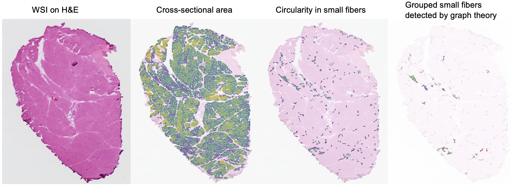

<<<<<<< HEAD
# Hifuku: Morphometric Analysis of Sural Nerve Biopsies
Hifuku, meaning 'sural' or 'saphenous' in Japanese, is an open-source machine learning-based software designed for Whole slide Morphometric Analysis in human sural nerve biopsies.





## Installation
Clone the Hifuku GitHub repository:
   ```python
   git clone https://github.com/onnonuro/hifuku.git
   ```


## Tutorial with Google Colab
Google Colab is the easiest way to try out Hifuku with GPU support,  especially  for clinicians and pathologists who are unfamiliar with programming or do not have a local Python environment. 

To get started:
1. **Download tutoial.ipynb**: Download [tutoial.ipynb](https://github.com/onnonuro/hifuku/blob/main/tutorial.ipynb).

2. **Upload tutoial.ipynb to your Google Drive**: Upload the file to your [Google Drive](https://www.google.com/drive/).

3. **Open tutoial.ipynb with Google Colab**: Sign in [Google Colab](https://colab.research.google.com/) and open tutoial.ipynb with it.

4. **Run Hifuku**: Follow the instructions in the Jupyter Notebook tutorial.

      *You need a google account and sign in to Google colab.


## Dependencies
Hifuku was tested in the following Google Clolab environment on November 21, 2023.

Python (3.10.12), torch (2.1.0+cu118), torchvision (0.16.0+cu118), torchmetrics (1.2.0), pytorch-lightning (2.1.2), segmentation-models-pytorch (0.3.3), timm (0.9.2), opencv-python (4.8.0.76), albumentations (1.3.1)


## Citation
Automated Whole Slide Morphometrics of Sural Nerve Biopsy by Machine Learning
=======
# mmmetry
automated muscle morphometry
>>>>>>> origin/main
